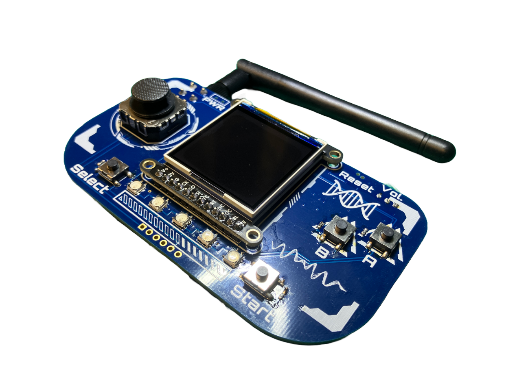

# Robotic-Insect-Control-Keypad-V1 (R.I.C.K.)

## Description

The Robotic Insect Control Keypad (R.I.C.K.) is a programmable wireless controller based on the powerful ESP32-S3 WiFi/BLE capable MCU. The controller features a two axis joystick, four buttons, five NeoPixel LEDs, a 240x240 pixel TFT backlit display, speaker, accelerometer and a 400 mAh battery for portable play. The board is intended for use in controlling quadripedal robots or it can be used as an arcade platform for game development. Our lab (Animal Inspired Motion and Robotics Lab) will is currently using this controller during demos of our robot platforms.

## Features

1. 240x240 1.54" TFT screen with backlight
2. Two axis analog joystick and four user buttons
3. Five programmable NeoPixels
4. Integrated DAC, 2.5W amplifier and speaker
5. Three axis accelerometer
6.  400 mAh LiPo battery

## Software

Coming soon! Currently under development.

## License

The board outline, joystick and buttons are based on the amazing [Adafruit Py Gamer](https://www.adafruit.com/product/4242)! Thanks Adafruit for making awesome stuff!

This work is licensed under the Creative Commons Attribution-ShareAlike 4.0 International License. To view a copy of this license, visit http://creativecommons.org/licenses/by-sa/4.0/ or send a letter to Creative Commons, PO Box 1866, Mountain View, CA 94042, USA.
